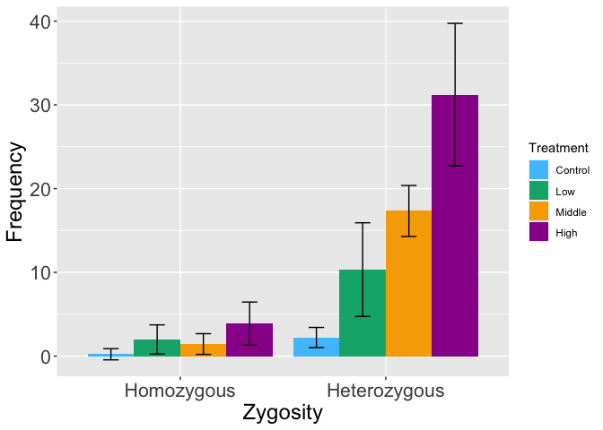

-   [Loading packages](#loading-packages)
-   [Loading data set](#loading-data-set)
-   [Data preprocessing](#data-preprocessing)
-   [Chi-square test](#chi-square-test)
-   [Plotting frequency of homozygous and heterozygous
    mutations](#plotting-frequency-of-homozygous-and-heterozygous-mutations)

------------------------------------------------------------------------

### Loading packages

``` r
library(stringr)
library(MASS)
library(glmmML)
library(tidyverse)
library(ggplot2)
library(RColorBrewer)
```

### Loading data set

``` r
AT_all_mutations <- read_csv("../M2.mutations.full.list.csv")
```

### Data preprocessing

``` r
sample.vec <- sort(unique(c(AT_all_mutations$Sample1,AT_all_mutations$Sample2,AT_all_mutations$Sample3)))

AT_all_mutations$Sample1 <- factor(AT_all_mutations$Sample1, levels=sample.vec)
AT_all_mutations$Sample2 <- factor(AT_all_mutations$Sample2, levels=sample.vec)
AT_all_mutations$Sample3 <- factor(AT_all_mutations$Sample3, levels=sample.vec)

AT_all_sbs <- AT_all_mutations %>% filter(Type=="SBS")
AT_all_indel <- AT_all_mutations %>% filter(Type!="SBS")
AT_all_insertion <- AT_all_mutations %>% filter(Type=="Insertion")
AT_all_deletion <- AT_all_mutations %>% filter(Type=="Deletion")

AT_all_family <- AT_all_mutations %>% filter(Sample2!="NA")

No_mutations_per_sample <- tapply(rep(AT_all_mutations$Chr,3), c(AT_all_mutations$Sample1,AT_all_mutations$Sample2,AT_all_mutations$Sample3), length)
No_mutations_per_sample[is.na(No_mutations_per_sample)] <- 0

No_family_mutations_per_sample <- tapply(rep(AT_all_family$Chr,3), c(AT_all_family$Sample1,AT_all_family$Sample2,AT_all_family$Sample3), length)
No_family_mutations_per_sample[is.na(No_family_mutations_per_sample)] <- 0

No_homo_mutations_per_sample <- tapply(c(AT_all_mutations$Chr[AT_all_mutations$Zygosity1=="homo"],AT_all_mutations$Chr[AT_all_mutations$Zygosity2=="homo"],AT_all_mutations$Chr[AT_all_mutations$Zygosity3=="homo"]), c(AT_all_mutations$Sample1[AT_all_mutations$Zygosity1=="homo"],AT_all_mutations$Sample2[AT_all_mutations$Zygosity2=="homo"],AT_all_mutations$Sample3[AT_all_mutations$Zygosity3=="homo"]), length)
No_homo_mutations_per_sample[is.na(No_homo_mutations_per_sample)] <- 0

No_hetero_mutations_per_sample <- tapply(c(AT_all_mutations$Chr[AT_all_mutations$Zygosity1=="hetero"],AT_all_mutations$Chr[AT_all_mutations$Zygosity2=="hetero"],AT_all_mutations$Chr[AT_all_mutations$Zygosity3=="hetero"]), c(AT_all_mutations$Sample1[AT_all_mutations$Zygosity1=="hetero"],AT_all_mutations$Sample2[AT_all_mutations$Zygosity2=="hetero"],AT_all_mutations$Sample3[AT_all_mutations$Zygosity3=="hetero"]), length)
No_hetero_mutations_per_sample[is.na(No_hetero_mutations_per_sample)] <- 0

No_sbs_per_sample <- tapply(rep(AT_all_sbs$Chr,3), c(AT_all_sbs$Sample1,AT_all_sbs$Sample2,AT_all_sbs$Sample3), length)
No_sbs_per_sample[is.na(No_sbs_per_sample)] <- 0

No_indel_per_sample <- tapply(rep(AT_all_indel$Chr,3), c(AT_all_indel$Sample1,AT_all_indel$Sample2,AT_all_indel$Sample3), length)
No_indel_per_sample[is.na(No_indel_per_sample)] <- 0

No_insertion_per_sample <- tapply(rep(AT_all_insertion$Chr,3), c(AT_all_insertion$Sample1,AT_all_insertion$Sample2,AT_all_insertion$Sample3), length)
No_insertion_per_sample[is.na(No_insertion_per_sample)] <- 0

No_deletion_per_sample <- tapply(rep(AT_all_deletion$Chr,3), c(AT_all_deletion$Sample1,AT_all_deletion$Sample2,AT_all_deletion$Sample3), length)
No_deletion_per_sample[is.na(No_deletion_per_sample)] <- 0

Treat.levels <- c("Control","Low","Middle","High")
treat <- c(rep("Control",9),rep("Low",9),rep("Middle",9),rep("High",9))
gray <- c(rep(0,9),rep(0.4,9),rep(1.4,9),rep(2.0,9))
Accumurate.gray <- gray*60
Accumurate.gray.revised <- c(rep(0,9),rep(23,9),rep(80,9),rep(114,9))
family <-c(rep("A01",3),rep("A02",3),rep("A03",3),rep("A11",3),rep("A12",3),rep("A13",3),rep("A21",3),rep("A22",3),rep("A23",3),rep("A31",3),rep("A32",3),rep("A33",3))

mutation_count_frame <- data.frame(SampleID = sample.vec, Family = family,
    Treat = treat, Gray = gray, TotalGray = Accumurate.gray,
    Mutation.Count =  No_mutations_per_sample,
    Mutation.family.Count = No_family_mutations_per_sample,
    Mutation.homo.Count = No_homo_mutations_per_sample,
    Mutation.hetero.Count = No_hetero_mutations_per_sample,
    HomoHeteroRatio=No_homo_mutations_per_sample/No_hetero_mutations_per_sample,
    SBS.Count = No_sbs_per_sample,
    INDEL.Count = No_indel_per_sample,
    Insertion.Count = No_insertion_per_sample,
    Deletion.Count = No_deletion_per_sample
)
mutation_count_frame$Family <- factor(mutation_count_frame$Family, levels=c("A01","A02","A03","A11","A12","A13","A21","A22","A23","A31","A32","A33"))

mutation_count_frame$Treat <- factor(mutation_count_frame$Treat, levels=Treat.levels)


#Summarized homo/hetero ratio
HomoHeteroRatio.treat.mean <- tapply(mutation_count_frame$HomoHeteroRatio, mutation_count_frame$Treat,mean)
mutation.total.mean <- tapply(mutation_count_frame$Mutation.Count, mutation_count_frame$Treat,mean)
mutation.total.sd <- tapply(mutation_count_frame$Mutation.Count, mutation_count_frame$Treat,sd)
mutation.homo.sum <- tapply(mutation_count_frame$Mutation.homo.Count, mutation_count_frame$Treat,sum)
mutation.homo.mean <- tapply(mutation_count_frame$Mutation.homo.Count, mutation_count_frame$Treat,mean)
mutation.homo.sd <- tapply(mutation_count_frame$Mutation.homo.Count, mutation_count_frame$Treat,sd)
mutation.hetero.sum <- tapply(mutation_count_frame$Mutation.hetero.Count, mutation_count_frame$Treat,sum)
mutation.hetero.mean <- tapply(mutation_count_frame$Mutation.hetero.Count, mutation_count_frame$Treat,mean)
mutation.hetero.sd <- tapply(mutation_count_frame$Mutation.hetero.Count, mutation_count_frame$Treat,sd)


Mutation.homo.hetero.total.mean <- c(mutation.homo.mean,mutation.hetero.mean, mutation.total.mean)
Mutation.homo.hetero.total.sd <- c(mutation.homo.sd,mutation.hetero.sd, mutation.total.sd)

Mutation.homo.hetero.mean <- c(mutation.homo.mean,mutation.hetero.mean)
Mutation.homo.hetero.sd <- c(mutation.homo.sd,mutation.hetero.sd)
```

### Chi-square test

``` r
kai.square.test.homo.hetero.control <- chisq.test(x=c(mutation.homo.sum[1],mutation.hetero.sum[1],p=c(1/3,2/3)))
print(kai.square.test.homo.hetero.control)
```

    ## 
    ##  Chi-squared test for given probabilities
    ## 
    ## data:  c(mutation.homo.sum[1], mutation.hetero.sum[1], p = c(1/3, 2/3))
    ## X-squared = 47.357, df = 3, p-value = 2.917e-10

``` r
kai.square.test.homo.hetero.low <- chisq.test(x=c(mutation.homo.sum[2],mutation.hetero.sum[2],p=c(1/3,2/3)))
print(kai.square.test.homo.hetero.low)
```

    ## 
    ##  Chi-squared test for given probabilities
    ## 
    ## data:  c(mutation.homo.sum[2], mutation.hetero.sum[2], p = c(1/3, 2/3))
    ## X-squared = 208.48, df = 3, p-value < 2.2e-16

``` r
kai.square.test.homo.hetero.middle <- chisq.test(x=c(mutation.homo.sum[3],mutation.hetero.sum[3],p=c(1/3,2/3)))
print(kai.square.test.homo.hetero.middle)
```

    ## 
    ##  Chi-squared test for given probabilities
    ## 
    ## data:  c(mutation.homo.sum[3], mutation.hetero.sum[3], p = c(1/3, 2/3))
    ## X-squared = 406.6, df = 3, p-value < 2.2e-16

``` r
kai.square.test.homo.hetero.high <- chisq.test(x=c(mutation.homo.sum[4],mutation.hetero.sum[4],p=c(1/3,2/3)))
print(kai.square.test.homo.hetero.high)
```

    ## 
    ##  Chi-squared test for given probabilities
    ## 
    ## data:  c(mutation.homo.sum[4], mutation.hetero.sum[4], p = c(1/3, 2/3))
    ## X-squared = 694.82, df = 3, p-value < 2.2e-16

``` r
kruskal.test.hetero.out <- kruskal.test(mutation_count_frame$Mutation.hetero.Coun~mutation_count_frame$Treat)
print(kruskal.test.hetero.out)
```

    ## 
    ##  Kruskal-Wallis rank sum test
    ## 
    ## data:  mutation_count_frame$Mutation.hetero.Coun by mutation_count_frame$Treat
    ## Kruskal-Wallis chi-squared = 30.103, df = 3, p-value = 1.313e-06

``` r
pairwise.wilcox.test.hetero <- pairwise.wilcox.test(mutation_count_frame$Mutation.hetero.Coun,mutation_count_frame$Treat,exact=F)
print(pairwise.wilcox.test.hetero)
```

    ## 
    ##  Pairwise comparisons using Wilcoxon rank sum test with continuity correction 
    ## 
    ## data:  mutation_count_frame$Mutation.hetero.Coun and mutation_count_frame$Treat 
    ## 
    ##        Control Low    Middle
    ## Low    0.0026  -      -     
    ## Middle 0.0023  0.0116 -     
    ## High   0.0023  0.0023 0.0026
    ## 
    ## P value adjustment method: holm

### Plotting frequency of homozygous and heterozygous mutations

``` r
Treat.lab <- c("Control: 0.0 Gy/day","Low: 0.4 Gy/day","Middle: 1.4 Gy/day","High: 2.0 Gy/day")
mutation.treat.mean.info <- data.frame(Mutation.mean= Mutation.homo.hetero.mean, Mutation.sd=Mutation.homo.hetero.sd, Treatment=rep(Treat.levels,2), Zygosity=c(rep("Homozygous",4),rep("Heterozygous",4)))
mutation.treat.mean.info$Treatment <- factor(mutation.treat.mean.info$Treatment, levels=Treat.levels)
mutation.treat.mean.info$Zygosity <- factor(mutation.treat.mean.info$Zygosity, levels=c("Homozygous","Heterozygous"))

cols = brewer.pal(4, "Pastel1")  # preparing colar palette

sora.col <- rgb(77/255,196/255,255/255)
midori.col <- rgb(3/255,175/255,122/255)
orange.col <- rgb(246/255,170/255,0/255)
murasaki.col <- rgb(153/255,0/255,153/255)

col.parette <- c(sora.col,midori.col,orange.col,murasaki.col)

g <- ggplot(mutation.treat.mean.info, aes(x = Zygosity, y = Mutation.mean, fill = Treatment)) +
    theme(axis.title.x = element_text(size=18), axis.title.y = element_text(size=18),
        axis.text.x = element_text(size=16),axis.text.y = element_text(size=16))
g <- g + geom_bar(stat = "identity", position ="dodge") + geom_errorbar(aes(ymin = Mutation.mean - Mutation.sd, ymax = Mutation.mean + Mutation.sd, width=0.3), position = position_dodge(width = 0.9)) + ylab("Frequency") + scale_fill_manual(values = col.parette)

plot(g)
```


\### Exact binomial test: the proportion of heterozygous mutations
(among all mutations) was significantly greater than expected under the
Mendelian segregation ratio?

``` r
No.sample <- length(mutation_count_frame$Sample)
binom.test.p <- numeric(No.sample)
binom.test.CI.lower <- numeric(No.sample)
binom.test.CI.upper <- numeric(No.sample)

for(i in 1:No.sample){
    target.hetero.count <- mutation_count_frame$Mutation.hetero.Count[i]
    target.homo.count <- mutation_count_frame$Mutation.homo.Count[i]
    binom.test.out <- binom.test(target.hetero.count, target.hetero.count+target.homo.count, 2/3, alternative="greater")
    binom.test.p[i] <- binom.test.out[3]
    binom.test.CI.lower[i] <- binom.test.out[[4]][1]
    binom.test.CI.upper[i] <- binom.test.out[[4]][2]
}
binom.test.p.vec <- unlist(binom.test.p)

hetero.homo.ratio.out.frame <- data.frame(
    SampleID = sample.vec, Family = family,
    Treat = treat, Gray = gray,
    Mutation.Count =  No_mutations_per_sample,
    Mutation.homo.Count =  No_homo_mutations_per_sample,
    Mutation.hetero.Count =  No_hetero_mutations_per_sample,
    Proportion.hetero=No_hetero_mutations_per_sample/No_mutations_per_sample,
    Binom.test.P=binom.test.p.vec,
    Binom.test.CI.lower=binom.test.CI.lower,
    Binom.test.CI.upper=binom.test.CI.upper
)

# Exporting a summary table of the binominal test
write.csv(hetero.homo.ratio.out.frame,"hetero.homo.test.summary.csv",quote=F, row.names=F)
```

------------------------------------------------------------------------
