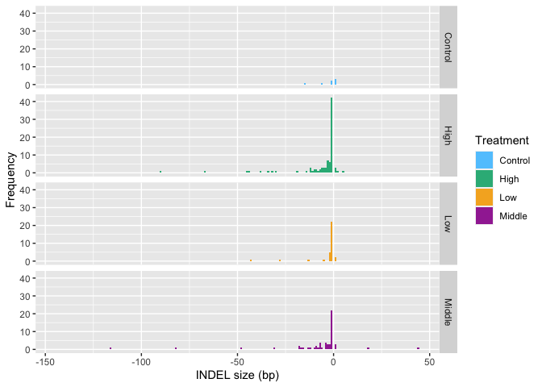

-   [Statistical modeling of the effect of radiation on size of
    mutation](#statistical-modeling-of-the-effect-of-radiation-on-size-of-mutation)
    -   [Loading packages](#loading-packages)
    -   [Loading data set](#loading-data-set)
    -   [Data preprocessing](#data-preprocessing)
    -   [Plotting indel-size
        distribution](#plotting-indel-size-distribution)
    -   [Statistical modeling of the effect of radiation on size of
        mutation](#statistical-modeling-of-the-effect-of-radiation-on-size-of-mutation-1)

------------------------------------------------------------------------

## Statistical modeling of the effect of radiation on size of mutation

### Loading packages

``` r
library(MASS)
library(glmmML)
library(lme4)
library(pscl)
library(AER)
library(tidyverse)
```

### Loading data set

``` r
AT_all_mutations <- read_csv("../M2.mutations.full.list.csv")
```

### Data preprocessing

``` r
sample.vec <- sort(unique(c(AT_all_mutations$Sample1,AT_all_mutations$Sample2,AT_all_mutations$Sample3)))

AT_all_mutations$Sample1 <- factor(AT_all_mutations$Sample1, levels=sample.vec)
AT_all_mutations$Sample2 <- factor(AT_all_mutations$Sample2, levels=sample.vec)
AT_all_mutations$Sample3 <- factor(AT_all_mutations$Sample3, levels=sample.vec)

AT_all_mutations$Type <- factor(AT_all_mutations$Type, levels=c("SBS","Deletion","Insertion"))
AT_all_mutations$Abs.Length <- abs(AT_all_mutations$Length)

AT_all_sbs <- AT_all_mutations %>% filter(Type=="SBS")
AT_all_indel <- AT_all_mutations %>% filter(Type!="SBS")
AT_all_insertion <- AT_all_mutations %>% filter(Type=="Insertion")
AT_all_deletion <- AT_all_mutations %>% filter(Type=="Deletion")

AT_all_family <- AT_all_mutations %>% filter(Sample2!="NA")
```

### Plotting indel-size distribution

``` r
sora.col <- rgb(77/255,196/255,255/255)
midori.col <- rgb(3/255,175/255,122/255)
orange.col <- rgb(246/255,170/255,0/255)
murasaki.col <- rgb(153/255,0/255,153/255)
akarui.murasaki.col <- rgb(201/255,172/255,230/255)
col.parette <- c(sora.col,midori.col,orange.col,murasaki.col)

g.hist <- ggplot(AT_all_indel, aes(x=Length, fill=Treatment)) 
g.hist <- g.hist + geom_histogram(breaks=seq(-145.5,45.5,by=1), position = "identity",alpha=0.9) + xlab("INDEL size (bp)") + ylab("Frequency") +facet_grid(Treatment~.) + scale_fill_manual(values = col.parette) 

plot(g.hist)
```



### Statistical modeling of the effect of radiation on size of mutation

``` r
# non-linear model
model.nsl.2nd.size <- nls(Abs.Length ~　a+b*Dose+c*Dose^2, data= AT_all_mutations, start=c(a=1, b=1, c=1),trace=T)
```

    ## 57716.43    (3.72e-01): par = (1 1 1)
    ## 50700.07    (2.17e-08): par = (-0.06861935 5.061776 -1.955036)

``` r
print(summary(model.nsl.2nd.size))
```

    ## 
    ## Formula: Abs.Length ~ a + b * Dose + c * Dose^2
    ## 
    ## Parameters:
    ##   Estimate Std. Error t value Pr(>|t|)  
    ## a -0.06862    1.40367  -0.049   0.9610  
    ## b  5.06178    2.89180   1.750   0.0806 .
    ## c -1.95504    1.21162  -1.614   0.1072  
    ## ---
    ## Signif. codes:  0 '***' 0.001 '**' 0.01 '*' 0.05 '.' 0.1 ' ' 1
    ## 
    ## Residual standard error: 9.325 on 583 degrees of freedom
    ## 
    ## Number of iterations to convergence: 1 
    ## Achieved convergence tolerance: 2.172e-08

``` r
# generalized linear model with a poisson distribution
model.glm.poisson.size <- glm(Abs.Length~Dose, family = poisson, data= AT_all_mutations)
print(summary(model.glm.poisson.size))
```

    ## 
    ## Call:
    ## glm(formula = Abs.Length ~ Dose, family = poisson, data = AT_all_mutations)
    ## 
    ## Deviance Residuals: 
    ##    Min      1Q  Median      3Q     Max  
    ## -2.274  -2.274  -2.122  -1.127  26.212  
    ## 
    ## Coefficients:
    ##             Estimate Std. Error z value Pr(>|z|)    
    ## (Intercept)  0.48878    0.07607   6.426 1.31e-10 ***
    ## Dose         0.23045    0.04527   5.091 3.57e-07 ***
    ## ---
    ## Signif. codes:  0 '***' 0.001 '**' 0.01 '*' 0.05 '.' 0.1 ' ' 1
    ## 
    ## (Dispersion parameter for poisson family taken to be 1)
    ## 
    ##     Null deviance: 6050.0  on 585  degrees of freedom
    ## Residual deviance: 6022.6  on 584  degrees of freedom
    ## AIC: 6564.8
    ## 
    ## Number of Fisher Scoring iterations: 7

``` r
# generalized linear model with a negative binomial distribution
model.glm.nb.size <- glm.nb(Abs.Length~Dose, data= AT_all_mutations)
print(summary(model.glm.nb.size))
```

    ## 
    ## Call:
    ## glm.nb(formula = Abs.Length ~ Dose, data = AT_all_mutations, 
    ##     init.theta = 0.1196908743, link = log)
    ## 
    ## Deviance Residuals: 
    ##     Min       1Q   Median       3Q      Max  
    ## -0.8680  -0.8680  -0.8444  -0.2826   3.3080  
    ## 
    ## Coefficients:
    ##             Estimate Std. Error z value Pr(>|z|)
    ## (Intercept)   0.3899     0.3077   1.267    0.205
    ## Dose          0.2952     0.1899   1.555    0.120
    ## 
    ## (Dispersion parameter for Negative Binomial(0.1197) family taken to be 1)
    ## 
    ##     Null deviance: 376.41  on 585  degrees of freedom
    ## Residual deviance: 374.59  on 584  degrees of freedom
    ## AIC: 1657.5
    ## 
    ## Number of Fisher Scoring iterations: 1
    ## 
    ## 
    ##               Theta:  0.1197 
    ##           Std. Err.:  0.0109 
    ## 
    ##  2 x log-likelihood:  -1651.4640

``` r
# Overdispersion test
odTest(model.glm.nb.size)
```

    ## Likelihood ratio test of H0: Poisson, as restricted NB model:
    ## n.b., the distribution of the test-statistic under H0 is non-standard
    ## e.g., see help(odTest) for details/references
    ## 
    ## Critical value of test statistic at the alpha= 0.05 level: 2.7055 
    ## Chi-Square Test Statistic =  4909.3012 p-value = < 2.2e-16

``` r
overdispertion.test.size <- dispersiontest(model.glm.poisson.size)
print(overdispertion.test.size)
```

    ## 
    ##  Overdispersion test
    ## 
    ## data:  model.glm.poisson.size
    ## z = 2.8632, p-value = 0.002097
    ## alternative hypothesis: true dispersion is greater than 1
    ## sample estimates:
    ## dispersion 
    ##   37.10226

``` r
# Hurdel model with a poisson distribution 
model.hurdle.poisson.size <- hurdle(Abs.Length~Dose, dist="poisson", data= AT_all_mutations)
print(summary(model.hurdle.poisson.size))
```

    ## 
    ## Call:
    ## hurdle(formula = Abs.Length ~ Dose, data = AT_all_mutations, dist = "poisson")
    ## 
    ## Pearson residuals:
    ##     Min      1Q  Median      3Q     Max 
    ## -0.6276 -0.6223 -0.6186 -0.3803 31.5009 
    ## 
    ## Count model coefficients (truncated poisson with log link):
    ##             Estimate Std. Error z value Pr(>|z|)    
    ## (Intercept)  1.55008    0.07815   19.84  < 2e-16 ***
    ## Dose         0.28780    0.04649    6.19 6.01e-10 ***
    ## Zero hurdle model coefficients (binomial with logit link):
    ##             Estimate Std. Error z value Pr(>|z|)   
    ## (Intercept) -0.66564    0.21842  -3.047  0.00231 **
    ## Dose        -0.06786    0.13580  -0.500  0.61726   
    ## ---
    ## Signif. codes:  0 '***' 0.001 '**' 0.01 '*' 0.05 '.' 0.1 ' ' 1 
    ## 
    ## Number of iterations in BFGS optimization: 10 
    ## Log-likelihood: -2081 on 4 Df

``` r
# Hurdel model with a negative binomial distribution 
model.hurdle.nb.size <- hurdle(Abs.Length~Dose, dist="negbin", data= AT_all_mutations)
print(summary(model.hurdle.nb.size))
```

    ## 
    ## Call:
    ## hurdle(formula = Abs.Length ~ Dose, data = AT_all_mutations, dist = "negbin")
    ## 
    ## Pearson residuals:
    ##     Min      1Q  Median      3Q     Max 
    ## -0.3865 -0.3287 -0.3082 -0.1963 16.8839 
    ## 
    ## Count model coefficients (truncated negbin with log link):
    ##             Estimate Std. Error z value Pr(>|z|)  
    ## (Intercept) -10.1418    56.9605  -0.178   0.8587  
    ## Dose          0.5781     0.2778   2.081   0.0374 *
    ## Log(theta)  -12.4106    56.9593  -0.218   0.8275  
    ## Zero hurdle model coefficients (binomial with logit link):
    ##             Estimate Std. Error z value Pr(>|z|)   
    ## (Intercept) -0.66564    0.21842  -3.047  0.00231 **
    ## Dose        -0.06786    0.13580  -0.500  0.61726   
    ## ---
    ## Signif. codes:  0 '***' 0.001 '**' 0.01 '*' 0.05 '.' 0.1 ' ' 1 
    ## 
    ## Theta: count = 0
    ## Number of iterations in BFGS optimization: 89 
    ## Log-likelihood: -814.4 on 5 Df

``` r
# AICs of each of models
AIC(model.nsl.2nd.size, model.glm.poisson.size, model.glm.nb.size, model.hurdle.poisson.size,model.hurdle.nb.size)
```

    ##                           df      AIC
    ## model.nsl.2nd.size         4 4284.769
    ## model.glm.poisson.size     2 6564.765
    ## model.glm.nb.size          3 1657.464
    ## model.hurdle.poisson.size  4 4169.895
    ## model.hurdle.nb.size       5 1638.700
