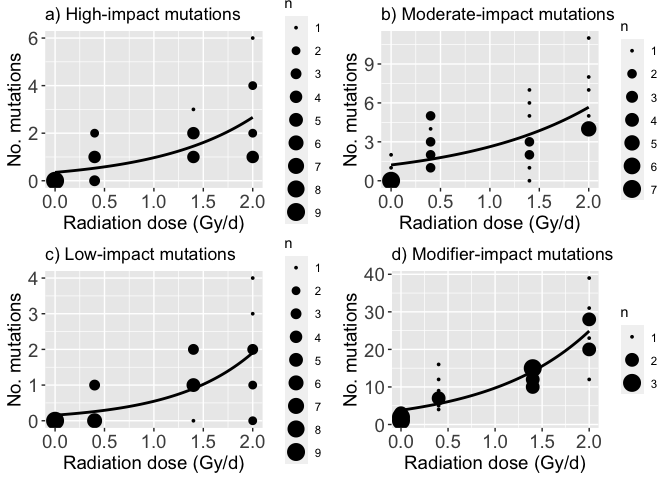

-   [Statistical modeling of the effect of radiation on gene
    function](#statistical-modeling-of-the-effect-of-radiation-on-gene-function)
    -   [Loading packages](#loading-packages)
    -   [Loading data set](#loading-data-set)
    -   [Data preprocessing](#data-preprocessing)
    -   [Statistical modeling of the effect of radiation on
        gene](#statistical-modeling-of-the-effect-of-radiation-on-gene)
    -   [Plotting impact of mutations on gene
        function](#plotting-impact-of-mutations-on-gene-function)

------------------------------------------------------------------------

## Statistical modeling of the effect of radiation on gene function

### Loading packages

``` r
library(ggplot2)
library(stringr)
library(MASS)
library(glmmML)
library(lme4)
library(tidyverse)
library(nlstools)
library(ggforce)
library(grid)
library(AER)
library(pscl)
```

### Loading data set

``` r
AT.all.mutations.annotation <- read_csv("../M2.mutations.full.list.annotation.csv")
```

### Data preprocessing

``` r
sample.vec <- c(sort(unique(AT.all.mutations.annotation$Sample1)))
AT.all.mutations.annotation$Sample1 <- factor(AT.all.mutations.annotation$Sample1, levels=sample.vec)
AT.all.mutations.annotation$Sample2 <- factor(AT.all.mutations.annotation$Sample2, levels=sample.vec)
AT.all.mutations.annotation$Sample3 <- factor(AT.all.mutations.annotation$Sample3, levels=sample.vec)

AT.all.family <- subset(AT.all.mutations.annotation, AT.all.mutations.annotation$Sample2!="NA")

AT.all.sbs <- AT.all.mutations.annotation %>% filter(Type=="SBS")
AT.all.indel <- AT.all.mutations.annotation %>% filter(Type!="SBS")
AT.all.insertion <- AT.all.mutations.annotation %>% filter(Type=="Insertion")
AT.all.deletion <- AT.all.mutations.annotation %>% filter(Type=="Deletion")

AT.all.HIGH <- AT.all.mutations.annotation %>% filter(Annotation_impact=="HIGH")
AT.all.MODERATE <- AT.all.mutations.annotation %>% filter(Annotation_impact=="MODERATE")
AT.all.LOW <- AT.all.mutations.annotation %>% filter(Annotation_impact=="LOW")
AT.all.MODIFIER <- AT.all.mutations.annotation %>% filter(Annotation_impact=="MODIFIER")

No.mutations.per.sample1 <- tapply(AT.all.mutations.annotation$Chr, AT.all.mutations.annotation$Sample1, length)
No.mutations.per.sample2 <- tapply(AT.all.mutations.annotation$Chr, AT.all.mutations.annotation$Sample2, length)
No.mutations.per.sample3 <- tapply(AT.all.mutations.annotation$Chr, AT.all.mutations.annotation$Sample3, length)
No.mutations.per.sample1[is.na(No.mutations.per.sample1)] <- 0
No.mutations.per.sample2[is.na(No.mutations.per.sample2)] <- 0
No.mutations.per.sample3[is.na(No.mutations.per.sample3)] <- 0
No.mutations.per.sample <- No.mutations.per.sample1 + No.mutations.per.sample2 + No.mutations.per.sample3

No.family.mutations.per.sample1 <- tapply(AT.all.family$Chr,AT.all.family$Sample1, length)
No.family.mutations.per.sample2 <- tapply(AT.all.family$Chr,AT.all.family$Sample2, length)
No.family.mutations.per.sample3 <- tapply(AT.all.family$Chr,AT.all.family$Sample3, length)
No.family.mutations.per.sample1[is.na(No.family.mutations.per.sample1)] <- 0
No.family.mutations.per.sample2[is.na(No.family.mutations.per.sample2)] <- 0
No.family.mutations.per.sample3[is.na(No.family.mutations.per.sample3)] <- 0
No.fammily.mutations.per.sample <- No.family.mutations.per.sample1 + No.family.mutations.per.sample2 + No.family.mutations.per.sample3

No.homo.mutations.per.sample1 <- tapply(AT.all.mutations.annotation$Chr[AT.all.mutations.annotation$Zygosity1=="homo"], AT.all.mutations.annotation$Sample1[AT.all.mutations.annotation$Zygosity1=="homo"], length)
No.homo.mutations.per.sample2 <- tapply(AT.all.mutations.annotation$Chr[AT.all.mutations.annotation$Zygosity2=="homo"], AT.all.mutations.annotation$Sample2[AT.all.mutations.annotation$Zygosity2=="homo"], length)
No.homo.mutations.per.sample3 <- tapply(AT.all.mutations.annotation$Chr[AT.all.mutations.annotation$Zygosity3=="homo"], AT.all.mutations.annotation$Sample3[AT.all.mutations.annotation$Zygosity3=="homo"], length)
No.homo.mutations.per.sample1[is.na(No.homo.mutations.per.sample1)] <- 0
No.homo.mutations.per.sample2[is.na(No.homo.mutations.per.sample2)] <- 0
No.homo.mutations.per.sample3[is.na(No.homo.mutations.per.sample3)] <- 0
No.homo.mutations.per.sample <- No.homo.mutations.per.sample1 + No.homo.mutations.per.sample2 + No.homo.mutations.per.sample3

No.hetero.mutations.per.sample1 <- tapply(AT.all.mutations.annotation$Chr[AT.all.mutations.annotation$Zygosity1=="hetero"], AT.all.mutations.annotation$Sample1[AT.all.mutations.annotation$Zygosity1=="hetero"], length)
No.hetero.mutations.per.sample2 <- tapply(AT.all.mutations.annotation$Chr[AT.all.mutations.annotation$Zygosity2=="hetero"], AT.all.mutations.annotation$Sample2[AT.all.mutations.annotation$Zygosity2=="hetero"], length)
No.hetero.mutations.per.sample3 <- tapply(AT.all.mutations.annotation$Chr[AT.all.mutations.annotation$Zygosity3=="hetero"], AT.all.mutations.annotation$Sample3[AT.all.mutations.annotation$Zygosity3=="hetero"], length)
No.hetero.mutations.per.sample1[is.na(No.hetero.mutations.per.sample1)] <- 0
No.hetero.mutations.per.sample2[is.na(No.hetero.mutations.per.sample2)] <- 0
No.hetero.mutations.per.sample3[is.na(No.hetero.mutations.per.sample3)] <- 0
No.hetero.mutations.per.sample <- No.hetero.mutations.per.sample1 + No.hetero.mutations.per.sample2 + No.hetero.mutations.per.sample3

No.sbs.per.sample1 <- tapply(AT.all.sbs$Chr, AT.all.sbs$Sample1, length)
No.sbs.per.sample2 <- tapply(AT.all.sbs$Chr, AT.all.sbs$Sample2, length)
No.sbs.per.sample3 <- tapply(AT.all.sbs$Chr, AT.all.sbs$Sample3, length)
No.sbs.per.sample1[is.na(No.sbs.per.sample1)] <- 0
No.sbs.per.sample2[is.na(No.sbs.per.sample2)] <- 0
No.sbs.per.sample3[is.na(No.sbs.per.sample3)] <- 0
No.sbs.per.sample <- No.sbs.per.sample1 + No.sbs.per.sample2 + No.sbs.per.sample3

No.indel.per.sample1 <- tapply(AT.all.indel$Chr, AT.all.indel$Sample1, length)
No.indel.per.sample2 <- tapply(AT.all.indel$Chr, AT.all.indel$Sample2, length)
No.indel.per.sample3 <- tapply(AT.all.indel$Chr, AT.all.indel$Sample3, length)
No.indel.per.sample1[is.na(No.indel.per.sample1)] <- 0
No.indel.per.sample2[is.na(No.indel.per.sample2)] <- 0
No.indel.per.sample3[is.na(No.indel.per.sample3)] <- 0
No.indel.per.sample <- No.indel.per.sample1 + No.indel.per.sample2 + No.indel.per.sample3

No.insertion.per.sample1 <- tapply(AT.all.insertion$Chr, AT.all.insertion$Sample1, length)
No.insertion.per.sample2 <- tapply(AT.all.insertion$Chr, AT.all.insertion$Sample2, length)
No.insertion.per.sample3 <- tapply(AT.all.insertion$Chr, AT.all.insertion$Sample3, length)
No.insertion.per.sample1[is.na(No.insertion.per.sample1)] <- 0
No.insertion.per.sample2[is.na(No.insertion.per.sample2)] <- 0
No.insertion.per.sample3[is.na(No.insertion.per.sample3)] <- 0
No.insertion.per.sample <- No.insertion.per.sample1 + No.insertion.per.sample2 + No.insertion.per.sample3

No.deletion.per.sample1 <- tapply(AT.all.deletion$Chr, AT.all.deletion$Sample1, length)
No.deletion.per.sample2 <- tapply(AT.all.deletion$Chr, AT.all.deletion$Sample2, length)
No.deletion.per.sample3 <- tapply(AT.all.deletion$Chr, AT.all.deletion$Sample3, length)
No.deletion.per.sample1[is.na(No.deletion.per.sample1)] <- 0
No.deletion.per.sample2[is.na(No.deletion.per.sample2)] <- 0
No.deletion.per.sample3[is.na(No.deletion.per.sample3)] <- 0
No.deletion.per.sample <- No.deletion.per.sample1 + No.deletion.per.sample2 + No.deletion.per.sample3

No.HIGH.per.sample1 <- tapply(AT.all.HIGH$Chr, AT.all.HIGH$Sample1, length)
No.HIGH.per.sample2 <- tapply(AT.all.HIGH$Chr, AT.all.HIGH$Sample2, length)
No.HIGH.per.sample3 <- tapply(AT.all.HIGH$Chr, AT.all.HIGH$Sample3, length)
No.HIGH.per.sample1[is.na(No.HIGH.per.sample1)] <- 0
No.HIGH.per.sample2[is.na(No.HIGH.per.sample2)] <- 0
No.HIGH.per.sample3[is.na(No.HIGH.per.sample3)] <- 0
No.HIGH.per.sample <- No.HIGH.per.sample1 + No.HIGH.per.sample2 + No.HIGH.per.sample3

No.MODERATE.per.sample1 <- tapply(AT.all.MODERATE$Chr, AT.all.MODERATE$Sample1, length)
No.MODERATE.per.sample2 <- tapply(AT.all.MODERATE$Chr, AT.all.MODERATE$Sample2, length)
No.MODERATE.per.sample3 <- tapply(AT.all.MODERATE$Chr, AT.all.MODERATE$Sample3, length)
No.MODERATE.per.sample1[is.na(No.MODERATE.per.sample1)] <- 0
No.MODERATE.per.sample2[is.na(No.MODERATE.per.sample2)] <- 0
No.MODERATE.per.sample3[is.na(No.MODERATE.per.sample3)] <- 0
No.MODERATE.per.sample <- No.MODERATE.per.sample1 + No.MODERATE.per.sample2 + No.MODERATE.per.sample3

No.LOW.per.sample1 <- tapply(AT.all.LOW$Chr, AT.all.LOW$Sample1, length)
No.LOW.per.sample2 <- tapply(AT.all.LOW$Chr, AT.all.LOW$Sample2, length)
No.LOW.per.sample3 <- tapply(AT.all.LOW$Chr, AT.all.LOW$Sample3, length)
No.LOW.per.sample1[is.na(No.LOW.per.sample1)] <- 0
No.LOW.per.sample2[is.na(No.LOW.per.sample2)] <- 0
No.LOW.per.sample3[is.na(No.LOW.per.sample3)] <- 0
No.LOW.per.sample <- No.LOW.per.sample1 + No.LOW.per.sample2 + No.LOW.per.sample3

No.MODIFIER.per.sample1 <- tapply(AT.all.MODIFIER$Chr, AT.all.MODIFIER$Sample1, length)
No.MODIFIER.per.sample2 <- tapply(AT.all.MODIFIER$Chr, AT.all.MODIFIER$Sample2, length)
No.MODIFIER.per.sample3 <- tapply(AT.all.MODIFIER$Chr, AT.all.MODIFIER$Sample3, length)
No.MODIFIER.per.sample1[is.na(No.MODIFIER.per.sample1)] <- 0
No.MODIFIER.per.sample2[is.na(No.MODIFIER.per.sample2)] <- 0
No.MODIFIER.per.sample3[is.na(No.MODIFIER.per.sample3)] <- 0
No.MODIFIER.per.sample <- No.MODIFIER.per.sample1 + No.MODIFIER.per.sample2 + No.MODIFIER.per.sample3

treat <- c(rep("Control",length=9),rep("Low",length=9),rep("Middle",length=9),rep("High",length=9))
gray <- c(rep(0,9),rep(0.4,9),rep(1.4,9),rep(2.0,9))
Group <- c(rep("Group1",18),rep("Group2",18))
Group <- factor(Group, levels=c("Group1", "Group2"))
Accumurate.gray <- gray*60
Accumurate.gray.revised <- c(rep(0,9),rep(23,9),rep(80,9),rep(114,9))
family <-c(rep("A01",3),rep("A02",3),rep("A03",3),rep("A11",3),rep("A12",3),rep("A13",3),rep("A21",3),rep("A22",3),rep("A23",3),rep("A31",3),rep("A32",3),rep("A33",3))
family <- factor(family, levels=c("A01","A02","A03","A11","A12","A13","A21","A22","A23","A31","A32","A33"))

mutation.annotation.count.frame <- data.frame(SampleID = sample.vec, Family = family,
    Treat = treat, Gray = gray, TotalGray = Accumurate.gray,
    Mutation.Count =  No.mutations.per.sample,
    Mutation.family.Count = No.fammily.mutations.per.sample,
    Mutation.homo.Count =  No.homo.mutations.per.sample,    
    Mutation.hetero.Count =  No.hetero.mutations.per.sample,    
    SBS.Count = No.sbs.per.sample,
    INDEL.Count = No.indel.per.sample,
    Insertion.Count = No.insertion.per.sample,
    Deletion.Count = No.deletion.per.sample,
    HIGH.Count = No.HIGH.per.sample,
    MODERATE.Count = No.MODERATE.per.sample,
    LOW.Count = No.LOW.per.sample,
    MODIFIER.Count = No.MODIFIER.per.sample,
    kakudai.group = Group
)

write.csv(mutation.annotation.count.frame, "No.mutations.annotation.summary.csv",quote=F, row.names=F)
```

### Statistical modeling of the effect of radiation on gene

#### HIGH impact

``` r
## generalized linear model with a poisson distribution
model.glm.poisson.HIGH <- glm(mutation.annotation.count.frame$HIGH.Count ~ mutation.annotation.count.frame$Gray, family = poisson)
print(summary(model.glm.poisson.HIGH))
```

    ## 
    ## Call:
    ## glm(formula = mutation.annotation.count.frame$HIGH.Count ~ mutation.annotation.count.frame$Gray, 
    ##     family = poisson)
    ## 
    ## Deviance Residuals: 
    ##     Min       1Q   Median       3Q      Max  
    ## -1.1709  -0.8397  -0.4127   0.5768   1.7510  
    ## 
    ## Coefficients:
    ##                                      Estimate Std. Error z value Pr(>|z|)    
    ## (Intercept)                           -1.0426     0.3782  -2.757  0.00584 ** 
    ## mutation.annotation.count.frame$Gray   1.0116     0.2293   4.411 1.03e-05 ***
    ## ---
    ## Signif. codes:  0 '***' 0.001 '**' 0.01 '*' 0.05 '.' 0.1 ' ' 1
    ## 
    ## (Dispersion parameter for poisson family taken to be 1)
    ## 
    ##     Null deviance: 52.371  on 35  degrees of freedom
    ## Residual deviance: 28.306  on 34  degrees of freedom
    ## AIC: 90.396
    ## 
    ## Number of Fisher Scoring iterations: 5

``` r
## generalized linear mixed model with a poisson distribution
model.glmer.poisson.HIGH <- glmer(HIGH.Count ~ Gray + (1|Family), family=poisson, data=mutation.annotation.count.frame)
print(summary(model.glmer.poisson.HIGH))
```

    ## Generalized linear mixed model fit by maximum likelihood (Laplace
    ##   Approximation) [glmerMod]
    ##  Family: poisson  ( log )
    ## Formula: HIGH.Count ~ Gray + (1 | Family)
    ##    Data: mutation.annotation.count.frame
    ## 
    ##      AIC      BIC   logLik deviance df.resid 
    ##     92.4     97.1    -43.2     86.4       33 
    ## 
    ## Scaled residuals: 
    ##     Min      1Q  Median      3Q     Max 
    ## -1.0204 -0.5937 -0.3919  0.6489  2.0418 
    ## 
    ## Random effects:
    ##  Groups Name        Variance Std.Dev.
    ##  Family (Intercept) 0        0       
    ## Number of obs: 36, groups:  Family, 12
    ## 
    ## Fixed effects:
    ##             Estimate Std. Error z value Pr(>|z|)    
    ## (Intercept)  -1.0426     0.3782  -2.757  0.00584 ** 
    ## Gray          1.0116     0.2293   4.411 1.03e-05 ***
    ## ---
    ## Signif. codes:  0 '***' 0.001 '**' 0.01 '*' 0.05 '.' 0.1 ' ' 1
    ## 
    ## Correlation of Fixed Effects:
    ##      (Intr)
    ## Gray -0.919
    ## optimizer (Nelder_Mead) convergence code: 0 (OK)
    ## boundary (singular) fit: see help('isSingular')

``` r
## generalized linear model with a negative binomial distribution
model.glm.nb.HIGH <- glm.nb(mutation.annotation.count.frame$HIGH.Count ~ mutation.annotation.count.frame$Gray)
print(summary(model.glm.nb.HIGH))
```

    ## 
    ## Call:
    ## glm.nb(formula = mutation.annotation.count.frame$HIGH.Count ~ 
    ##     mutation.annotation.count.frame$Gray, init.theta = 13373.36176, 
    ##     link = log)
    ## 
    ## Deviance Residuals: 
    ##     Min       1Q   Median       3Q      Max  
    ## -1.1708  -0.8397  -0.4127   0.5768   1.7507  
    ## 
    ## Coefficients:
    ##                                      Estimate Std. Error z value Pr(>|z|)    
    ## (Intercept)                           -1.0427     0.3782  -2.757  0.00584 ** 
    ## mutation.annotation.count.frame$Gray   1.0116     0.2294   4.411 1.03e-05 ***
    ## ---
    ## Signif. codes:  0 '***' 0.001 '**' 0.01 '*' 0.05 '.' 0.1 ' ' 1
    ## 
    ## (Dispersion parameter for Negative Binomial(13373.36) family taken to be 1)
    ## 
    ##     Null deviance: 52.366  on 35  degrees of freedom
    ## Residual deviance: 28.303  on 34  degrees of freedom
    ## AIC: 92.396
    ## 
    ## Number of Fisher Scoring iterations: 1
    ## 
    ## 
    ##               Theta:  13373 
    ##           Std. Err.:  323870 
    ## Warning while fitting theta: iteration limit reached 
    ## 
    ##  2 x log-likelihood:  -86.396

``` r
## generalized linear mixed model with a negative binomial distribution
model.glmer.nb.HIGH <- glmer.nb(HIGH.Count ~ Gray + (1|Family), data=mutation.annotation.count.frame)
print(summary(model.glmer.nb.HIGH))
```

    ## Generalized linear mixed model fit by maximum likelihood (Laplace
    ##   Approximation) [glmerMod]
    ##  Family: Negative Binomial(35471.19)  ( log )
    ## Formula: HIGH.Count ~ Gray + (1 | Family)
    ##    Data: mutation.annotation.count.frame
    ## 
    ##      AIC      BIC   logLik deviance df.resid 
    ##     94.4    100.7    -43.2     86.4       32 
    ## 
    ## Scaled residuals: 
    ##     Min      1Q  Median      3Q     Max 
    ## -1.0204 -0.5937 -0.3919  0.6489  2.0417 
    ## 
    ## Random effects:
    ##  Groups Name        Variance  Std.Dev. 
    ##  Family (Intercept) 1.782e-11 4.221e-06
    ## Number of obs: 36, groups:  Family, 12
    ## 
    ## Fixed effects:
    ##             Estimate Std. Error z value Pr(>|z|)    
    ## (Intercept)  -1.0426     0.3778  -2.760  0.00579 ** 
    ## Gray          1.0116     0.2292   4.414 1.02e-05 ***
    ## ---
    ## Signif. codes:  0 '***' 0.001 '**' 0.01 '*' 0.05 '.' 0.1 ' ' 1
    ## 
    ## Correlation of Fixed Effects:
    ##      (Intr)
    ## Gray -0.919
    ## optimizer (Nelder_Mead) convergence code: 0 (OK)
    ## boundary (singular) fit: see help('isSingular')

``` r
## non-linear model
model.nls.2nd.HIGH <- nls(mutation.annotation.count.frame$HIGH.Count ~　a+b*mutation.annotation.count.frame$Gray+c*(mutation.annotation.count.frame$Gray)^2, data= mutation.annotation.count.frame, start=c(a=1, b=1, c=1),trace=T)
```

    ## 300.2288    (2.71e+00): par = (1 1 1)
    ## 35.95056    (8.58e-09): par = (0.1228464 1.440824 -0.1579276)

``` r
print(summary(model.nls.2nd.HIGH))
```

    ## 
    ## Formula: mutation.annotation.count.frame$HIGH.Count ~ a + b * mutation.annotation.count.frame$Gray + 
    ##     c * (mutation.annotation.count.frame$Gray)^2
    ## 
    ## Parameters:
    ##   Estimate Std. Error t value Pr(>|t|)
    ## a   0.1228     0.3185   0.386    0.702
    ## b   1.4408     0.9449   1.525    0.137
    ## c  -0.1579     0.4619  -0.342    0.735
    ## 
    ## Residual standard error: 1.044 on 33 degrees of freedom
    ## 
    ## Number of iterations to convergence: 1 
    ## Achieved convergence tolerance: 8.578e-09

``` r
## Overdispersion test
odTest(model.glm.nb.HIGH)
```

    ## Likelihood ratio test of H0: Poisson, as restricted NB model:
    ## n.b., the distribution of the test-statistic under H0 is non-standard
    ## e.g., see help(odTest) for details/references
    ## 
    ## Critical value of test statistic at the alpha= 0.05 level: 2.7055 
    ## Chi-Square Test Statistic =  -5e-04 p-value = 0.5

``` r
overdispertion.HIGH <- dispersiontest(model.glm.poisson.HIGH)
print(overdispertion.HIGH)
```

    ## 
    ##  Overdispersion test
    ## 
    ## data:  model.glm.poisson.HIGH
    ## z = -1.2111, p-value = 0.8871
    ## alternative hypothesis: true dispersion is greater than 1
    ## sample estimates:
    ## dispersion 
    ##  0.8322326

``` r
AIC(model.glm.poisson.HIGH,model.glmer.poisson.HIGH,model.glm.nb.HIGH,model.glmer.nb.HIGH, model.nls.2nd.HIGH)
```

    ##                          df       AIC
    ## model.glm.poisson.HIGH    2  90.39591
    ## model.glmer.poisson.HIGH  3  92.39591
    ## model.glm.nb.HIGH         3  92.39641
    ## model.glmer.nb.HIGH       4  94.39610
    ## model.nls.2nd.HIGH        4 110.11410

#### Moderate impact

``` r
## generalized linear model with a poisson distribution
model.glm.poisson.MODERATE <- glm(mutation.annotation.count.frame$MODERATE.Count ~ mutation.annotation.count.frame$Gray, family = poisson)
print(summary(model.glm.poisson.MODERATE))
```

    ## 
    ## Call:
    ## glm(formula = mutation.annotation.count.frame$MODERATE.Count ~ 
    ##     mutation.annotation.count.frame$Gray, family = poisson)
    ## 
    ## Deviance Residuals: 
    ##     Min       1Q   Median       3Q      Max  
    ## -2.6728  -1.0707  -0.4304   0.7644   2.0902  
    ## 
    ## Coefficients:
    ##                                      Estimate Std. Error z value Pr(>|z|)    
    ## (Intercept)                            0.1956     0.2126   0.920    0.358    
    ## mutation.annotation.count.frame$Gray   0.7697     0.1352   5.693 1.25e-08 ***
    ## ---
    ## Signif. codes:  0 '***' 0.001 '**' 0.01 '*' 0.05 '.' 0.1 ' ' 1
    ## 
    ## (Dispersion parameter for poisson family taken to be 1)
    ## 
    ##     Null deviance: 91.654  on 35  degrees of freedom
    ## Residual deviance: 55.001  on 34  degrees of freedom
    ## AIC: 145.02
    ## 
    ## Number of Fisher Scoring iterations: 5

``` r
## generalized linear mixed model with a poisson distribution
model.glmer.poisson.MODERATE <- glmer(MODERATE.Count ~ Gray + (1|Family), family=poisson, data=mutation.annotation.count.frame)
print(summary(model.glmer.poisson.MODERATE))
```

    ## Generalized linear mixed model fit by maximum likelihood (Laplace
    ##   Approximation) [glmerMod]
    ##  Family: poisson  ( log )
    ## Formula: MODERATE.Count ~ Gray + (1 | Family)
    ##    Data: mutation.annotation.count.frame
    ## 
    ##      AIC      BIC   logLik deviance df.resid 
    ##    145.9    150.6    -69.9    139.9       33 
    ## 
    ## Scaled residuals: 
    ##     Min      1Q  Median      3Q     Max 
    ## -1.7176 -0.9416 -0.2429  0.5072  2.2610 
    ## 
    ## Random effects:
    ##  Groups Name        Variance Std.Dev.
    ##  Family (Intercept) 0.08703  0.295   
    ## Number of obs: 36, groups:  Family, 12
    ## 
    ## Fixed effects:
    ##             Estimate Std. Error z value Pr(>|z|)    
    ## (Intercept)   0.1111     0.2816   0.394    0.693    
    ## Gray          0.8085     0.1880   4.300 1.71e-05 ***
    ## ---
    ## Signif. codes:  0 '***' 0.001 '**' 0.01 '*' 0.05 '.' 0.1 ' ' 1
    ## 
    ## Correlation of Fixed Effects:
    ##      (Intr)
    ## Gray -0.868

``` r
## generalized linear model with a negative binomial distribution
model.glm.nb.MODERATE <- glm.nb(mutation.annotation.count.frame$MODERATE.Count ~ mutation.annotation.count.frame$Gray)
print(summary(model.glm.nb.MODERATE))
```

    ## 
    ## Call:
    ## glm.nb(formula = mutation.annotation.count.frame$MODERATE.Count ~ 
    ##     mutation.annotation.count.frame$Gray, init.theta = 11.09619572, 
    ##     link = log)
    ## 
    ## Deviance Residuals: 
    ##     Min       1Q   Median       3Q      Max  
    ## -2.4910  -0.9712  -0.3934   0.6463   1.8959  
    ## 
    ## Coefficients:
    ##                                      Estimate Std. Error z value Pr(>|z|)    
    ## (Intercept)                            0.1862     0.2287   0.814    0.416    
    ## mutation.annotation.count.frame$Gray   0.7779     0.1511   5.148 2.64e-07 ***
    ## ---
    ## Signif. codes:  0 '***' 0.001 '**' 0.01 '*' 0.05 '.' 0.1 ' ' 1
    ## 
    ## (Dispersion parameter for Negative Binomial(11.0962) family taken to be 1)
    ## 
    ##     Null deviance: 74.946  on 35  degrees of freedom
    ## Residual deviance: 45.761  on 34  degrees of freedom
    ## AIC: 145.99
    ## 
    ## Number of Fisher Scoring iterations: 1
    ## 
    ## 
    ##               Theta:  11.1 
    ##           Std. Err.:  13.6 
    ## 
    ##  2 x log-likelihood:  -139.986

``` r
## generalized linear mixed model with a negative binomial distribution
model.glmer.nb.MODERATE <- glmer.nb(MODERATE.Count ~ Gray + (1|Family), data=mutation.annotation.count.frame)
print(summary(model.glmer.nb.MODERATE))
```

    ## Generalized linear mixed model fit by maximum likelihood (Laplace
    ##   Approximation) [glmerMod]
    ##  Family: Negative Binomial(93.5761)  ( log )
    ## Formula: MODERATE.Count ~ Gray + (1 | Family)
    ##    Data: mutation.annotation.count.frame
    ## 
    ##      AIC      BIC   logLik deviance df.resid 
    ##    147.7    154.1    -69.9    139.7       32 
    ## 
    ## Scaled residuals: 
    ##     Min      1Q  Median      3Q     Max 
    ## -1.6967 -0.9417 -0.2443  0.5254  2.2567 
    ## 
    ## Random effects:
    ##  Groups Name        Variance Std.Dev.
    ##  Family (Intercept) 0.08373  0.2894  
    ## Number of obs: 36, groups:  Family, 12
    ## 
    ## Fixed effects:
    ##             Estimate Std. Error z value Pr(>|z|)    
    ## (Intercept)   0.1121     0.2832   0.396    0.692    
    ## Gray          0.8083     0.1887   4.284 1.84e-05 ***
    ## ---
    ## Signif. codes:  0 '***' 0.001 '**' 0.01 '*' 0.05 '.' 0.1 ' ' 1
    ## 
    ## Correlation of Fixed Effects:
    ##      (Intr)
    ## Gray -0.868

``` r
## non-linear model
model.nls.2nd.MODERATE <- nls(mutation.annotation.count.frame$MODERATE.Count ~　a+b*mutation.annotation.count.frame$Gray+c*(mutation.annotation.count.frame$Gray)^2, data= mutation.annotation.count.frame, start=c(a=1, b=1, c=1),trace=T)
```

    ## 163.9888    (4.47e-01): par = (1 1 1)
    ## 136.7202    (1.87e-07): par = (0.9370787 2.250499 -0.03089885)

``` r
print(summary(model.nls.2nd.MODERATE))
```

    ## 
    ## Formula: mutation.annotation.count.frame$MODERATE.Count ~ a + b * mutation.annotation.count.frame$Gray + 
    ##     c * (mutation.annotation.count.frame$Gray)^2
    ## 
    ## Parameters:
    ##   Estimate Std. Error t value Pr(>|t|)
    ## a   0.9371     0.6212   1.509    0.141
    ## b   2.2505     1.8427   1.221    0.231
    ## c  -0.0309     0.9008  -0.034    0.973
    ## 
    ## Residual standard error: 2.035 on 33 degrees of freedom
    ## 
    ## Number of iterations to convergence: 1 
    ## Achieved convergence tolerance: 1.87e-07

``` r
## Overdispersion test
odTest(model.glm.nb.MODERATE)
```

    ## Likelihood ratio test of H0: Poisson, as restricted NB model:
    ## n.b., the distribution of the test-statistic under H0 is non-standard
    ## e.g., see help(odTest) for details/references
    ## 
    ## Critical value of test statistic at the alpha= 0.05 level: 2.7055 
    ## Chi-Square Test Statistic =  1.0294 p-value = 0.1551

``` r
overdispertion.MODERATE <- dispersiontest(model.glm.poisson.MODERATE)
print(overdispertion.MODERATE)
```

    ## 
    ##  Overdispersion test
    ## 
    ## data:  model.glm.poisson.MODERATE
    ## z = 1.7539, p-value = 0.03973
    ## alternative hypothesis: true dispersion is greater than 1
    ## sample estimates:
    ## dispersion 
    ##   1.410767

``` r
AIC(model.glm.poisson.MODERATE,model.glmer.poisson.MODERATE,model.glm.nb.MODERATE,model.glmer.nb.MODERATE, model.nls.2nd.MODERATE)
```

    ##                              df      AIC
    ## model.glm.poisson.MODERATE    2 145.0155
    ## model.glmer.poisson.MODERATE  3 145.8573
    ## model.glm.nb.MODERATE         3 145.9860
    ## model.glmer.nb.MODERATE       4 147.7171
    ## model.nls.2nd.MODERATE        4 158.2026

#### Low impact

``` r
## generalized linear model with a poisson distribution
model.glm.poisson.LOW <- glm(mutation.annotation.count.frame$LOW.Count ~ mutation.annotation.count.frame$Gray, family = poisson)
print(summary(model.glm.poisson.LOW))
```

    ## 
    ## Call:
    ## glm(formula = mutation.annotation.count.frame$LOW.Count ~ mutation.annotation.count.frame$Gray, 
    ##     family = poisson)
    ## 
    ## Deviance Residuals: 
    ##     Min       1Q   Median       3Q      Max  
    ## -1.9528  -0.7185  -0.5596   0.1027   1.3194  
    ## 
    ## Coefficients:
    ##                                      Estimate Std. Error z value Pr(>|z|)    
    ## (Intercept)                           -1.8542     0.5405  -3.431 0.000602 ***
    ## mutation.annotation.count.frame$Gray   1.2498     0.3159   3.956 7.61e-05 ***
    ## ---
    ## Signif. codes:  0 '***' 0.001 '**' 0.01 '*' 0.05 '.' 0.1 ' ' 1
    ## 
    ## (Dispersion parameter for poisson family taken to be 1)
    ## 
    ##     Null deviance: 46.859  on 35  degrees of freedom
    ## Residual deviance: 25.380  on 34  degrees of freedom
    ## AIC: 71.32
    ## 
    ## Number of Fisher Scoring iterations: 5

``` r
## generalized linear mixed model with a poisson distribution
model.glmer.poisson.LOW <- glmer(LOW.Count ~ Gray + (1|Family), family=poisson, data=mutation.annotation.count.frame)
print(summary(model.glmer.poisson.LOW))
```

    ## Generalized linear mixed model fit by maximum likelihood (Laplace
    ##   Approximation) [glmerMod]
    ##  Family: poisson  ( log )
    ## Formula: LOW.Count ~ Gray + (1 | Family)
    ##    Data: mutation.annotation.count.frame
    ## 
    ##      AIC      BIC   logLik deviance df.resid 
    ##     73.3     78.1    -33.7     67.3       33 
    ## 
    ## Scaled residuals: 
    ##     Min      1Q  Median      3Q     Max 
    ## -1.3808 -0.5081 -0.3957  0.1045  1.5160 
    ## 
    ## Random effects:
    ##  Groups Name        Variance Std.Dev.
    ##  Family (Intercept) 0        0       
    ## Number of obs: 36, groups:  Family, 12
    ## 
    ## Fixed effects:
    ##             Estimate Std. Error z value Pr(>|z|)    
    ## (Intercept)  -1.8542     0.5405  -3.430 0.000602 ***
    ## Gray          1.2498     0.3159   3.956 7.61e-05 ***
    ## ---
    ## Signif. codes:  0 '***' 0.001 '**' 0.01 '*' 0.05 '.' 0.1 ' ' 1
    ## 
    ## Correlation of Fixed Effects:
    ##      (Intr)
    ## Gray -0.939
    ## optimizer (Nelder_Mead) convergence code: 0 (OK)
    ## boundary (singular) fit: see help('isSingular')

``` r
## generalized linear model with a negative binomial distribution
model.glm.nb.LOW <- glm.nb(mutation.annotation.count.frame$LOW.Count ~ mutation.annotation.count.frame$Gray)
print(summary(model.glm.nb.LOW))
```

    ## 
    ## Call:
    ## glm.nb(formula = mutation.annotation.count.frame$LOW.Count ~ 
    ##     mutation.annotation.count.frame$Gray, init.theta = 12894.4387, 
    ##     link = log)
    ## 
    ## Deviance Residuals: 
    ##     Min       1Q   Median       3Q      Max  
    ## -1.9527  -0.7185  -0.5596   0.1027   1.3192  
    ## 
    ## Coefficients:
    ##                                      Estimate Std. Error z value Pr(>|z|)    
    ## (Intercept)                           -1.8542     0.5405  -3.430 0.000603 ***
    ## mutation.annotation.count.frame$Gray   1.2498     0.3159   3.956 7.61e-05 ***
    ## ---
    ## Signif. codes:  0 '***' 0.001 '**' 0.01 '*' 0.05 '.' 0.1 ' ' 1
    ## 
    ## (Dispersion parameter for Negative Binomial(12894.44) family taken to be 1)
    ## 
    ##     Null deviance: 46.856  on 35  degrees of freedom
    ## Residual deviance: 25.379  on 34  degrees of freedom
    ## AIC: 73.321
    ## 
    ## Number of Fisher Scoring iterations: 1
    ## 
    ## 
    ##               Theta:  12894 
    ##           Std. Err.:  286738 
    ## Warning while fitting theta: iteration limit reached 
    ## 
    ##  2 x log-likelihood:  -67.321

``` r
## generalized linear mixed model with a negative binomial distribution
model.glmer.nb.LOW <- glmer.nb(LOW.Count ~ Gray + (1|Family), data=mutation.annotation.count.frame)
print(summary(model.glmer.nb.LOW))
```

    ## Generalized linear mixed model fit by maximum likelihood (Laplace
    ##   Approximation) [glmerMod]
    ##  Family: Negative Binomial(34122.04)  ( log )
    ## Formula: LOW.Count ~ Gray + (1 | Family)
    ##    Data: mutation.annotation.count.frame
    ## 
    ##      AIC      BIC   logLik deviance df.resid 
    ##     75.3     81.7    -33.7     67.3       32 
    ## 
    ## Scaled residuals: 
    ##     Min      1Q  Median      3Q     Max 
    ## -1.3808 -0.5081 -0.3957  0.1045  1.5159 
    ## 
    ## Random effects:
    ##  Groups Name        Variance  Std.Dev. 
    ##  Family (Intercept) 2.525e-11 5.025e-06
    ## Number of obs: 36, groups:  Family, 12
    ## 
    ## Fixed effects:
    ##             Estimate Std. Error z value Pr(>|z|)    
    ## (Intercept)  -1.8542     0.5374  -3.450  0.00056 ***
    ## Gray          1.2498     0.3145   3.974 7.08e-05 ***
    ## ---
    ## Signif. codes:  0 '***' 0.001 '**' 0.01 '*' 0.05 '.' 0.1 ' ' 1
    ## 
    ## Correlation of Fixed Effects:
    ##      (Intr)
    ## Gray -0.939
    ## optimizer (Nelder_Mead) convergence code: 0 (OK)
    ## boundary (singular) fit: see help('isSingular')

``` r
## non-linear model
model.nls.2nd.LOW <- nls(mutation.annotation.count.frame$LOW.Count ~　a+b*mutation.annotation.count.frame$Gray+c*(mutation.annotation.count.frame$Gray)^2, data= mutation.annotation.count.frame, start=c(a=1, b=1, c=1),trace=T)
```

    ## 386.7088    (4.33e+00): par = (1 1 1)
    ## 19.56355    (2.64e-08): par = (-0.01198503 0.9339576 -0.04556807)

``` r
print(summary(model.nls.2nd.LOW))
```

    ## 
    ## Formula: mutation.annotation.count.frame$LOW.Count ~ a + b * mutation.annotation.count.frame$Gray + 
    ##     c * (mutation.annotation.count.frame$Gray)^2
    ## 
    ## Parameters:
    ##   Estimate Std. Error t value Pr(>|t|)
    ## a -0.01199    0.23497  -0.051    0.960
    ## b  0.93396    0.69704   1.340    0.189
    ## c -0.04557    0.34074  -0.134    0.894
    ## 
    ## Residual standard error: 0.77 on 33 degrees of freedom
    ## 
    ## Number of iterations to convergence: 1 
    ## Achieved convergence tolerance: 2.643e-08

``` r
## Overdispersion test
odTest(model.glm.nb.LOW)
```

    ## Likelihood ratio test of H0: Poisson, as restricted NB model:
    ## n.b., the distribution of the test-statistic under H0 is non-standard
    ## e.g., see help(odTest) for details/references
    ## 
    ## Critical value of test statistic at the alpha= 0.05 level: 2.7055 
    ## Chi-Square Test Statistic =  -6e-04 p-value = 0.5

``` r
overdispertion.LOW <- dispersiontest(model.glm.poisson.LOW)
print(overdispertion.LOW)
```

    ## 
    ##  Overdispersion test
    ## 
    ## data:  model.glm.poisson.LOW
    ## z = -1.8254, p-value = 0.966
    ## alternative hypothesis: true dispersion is greater than 1
    ## sample estimates:
    ## dispersion 
    ##    0.72911

``` r
AIC(model.glm.poisson.LOW,model.glmer.poisson.LOW,model.glm.nb.LOW,model.glmer.nb.LOW, model.nls.2nd.LOW)
```

    ##                         df      AIC
    ## model.glm.poisson.LOW    2 71.32020
    ## model.glmer.poisson.LOW  3 73.32020
    ## model.glm.nb.LOW         3 73.32080
    ## model.glmer.nb.LOW       4 75.32042
    ## model.nls.2nd.LOW        4 88.20894

#### Modifier impact

``` r
## generalized linear model with a poisson distribution
model.glm.poisson.MODIFIER <- glm(mutation.annotation.count.frame$MODIFIER.Count ~ mutation.annotation.count.frame$Gray, family = poisson)
print(summary(model.glm.poisson.MODIFIER))
```

    ## 
    ## Call:
    ## glm(formula = mutation.annotation.count.frame$MODIFIER.Count ~ 
    ##     mutation.annotation.count.frame$Gray, family = poisson)
    ## 
    ## Deviance Residuals: 
    ##     Min       1Q   Median       3Q      Max  
    ## -2.8652  -1.0080  -0.3032   0.5945   3.6068  
    ## 
    ## Coefficients:
    ##                                      Estimate Std. Error z value Pr(>|z|)    
    ## (Intercept)                            1.3376     0.1167   11.47   <2e-16 ***
    ## mutation.annotation.count.frame$Gray   0.9373     0.0717   13.07   <2e-16 ***
    ## ---
    ## Signif. codes:  0 '***' 0.001 '**' 0.01 '*' 0.05 '.' 0.1 ' ' 1
    ## 
    ## (Dispersion parameter for poisson family taken to be 1)
    ## 
    ##     Null deviance: 264.182  on 35  degrees of freedom
    ## Residual deviance:  58.951  on 34  degrees of freedom
    ## AIC: 205.68
    ## 
    ## Number of Fisher Scoring iterations: 4

``` r
## generalized linear mixed model with a poisson distribution
model.glmer.poisson.MODIFIER <- glmer(MODIFIER.Count ~ Gray + (1|Family), family=poisson, data=mutation.annotation.count.frame)
print(summary(model.glmer.poisson.MODIFIER))
```

    ## Generalized linear mixed model fit by maximum likelihood (Laplace
    ##   Approximation) [glmerMod]
    ##  Family: poisson  ( log )
    ## Formula: MODIFIER.Count ~ Gray + (1 | Family)
    ##    Data: mutation.annotation.count.frame
    ## 
    ##      AIC      BIC   logLik deviance df.resid 
    ##    205.1    209.9    -99.6    199.1       33 
    ## 
    ## Scaled residuals: 
    ##     Min      1Q  Median      3Q     Max 
    ## -2.4415 -0.6914 -0.1020  0.3987  3.0759 
    ## 
    ## Random effects:
    ##  Groups Name        Variance Std.Dev.
    ##  Family (Intercept) 0.05156  0.2271  
    ## Number of obs: 36, groups:  Family, 12
    ## 
    ## Fixed effects:
    ##             Estimate Std. Error z value Pr(>|z|)    
    ## (Intercept)   1.2752     0.1691   7.541 4.66e-14 ***
    ## Gray          0.9721     0.1182   8.222  < 2e-16 ***
    ## ---
    ## Signif. codes:  0 '***' 0.001 '**' 0.01 '*' 0.05 '.' 0.1 ' ' 1
    ## 
    ## Correlation of Fixed Effects:
    ##      (Intr)
    ## Gray -0.855

``` r
## generalized linear model with a negative binomial distribution
model.glm.nb.MODIFIER <- glm.nb(mutation.annotation.count.frame$MODIFIER.Count ~ mutation.annotation.count.frame$Gray)
print(summary(model.glm.nb.MODIFIER))
```

    ## 
    ## Call:
    ## glm.nb(formula = mutation.annotation.count.frame$MODIFIER.Count ~ 
    ##     mutation.annotation.count.frame$Gray, init.theta = 21.40492838, 
    ##     link = log)
    ## 
    ## Deviance Residuals: 
    ##     Min       1Q   Median       3Q      Max  
    ## -2.0719  -0.7593  -0.2352   0.4110   3.0676  
    ## 
    ## Coefficients:
    ##                                      Estimate Std. Error z value Pr(>|z|)    
    ## (Intercept)                           1.33565    0.13156   10.15   <2e-16 ***
    ## mutation.annotation.count.frame$Gray  0.93942    0.08687   10.81   <2e-16 ***
    ## ---
    ## Signif. codes:  0 '***' 0.001 '**' 0.01 '*' 0.05 '.' 0.1 ' ' 1
    ## 
    ## (Dispersion parameter for Negative Binomial(21.4049) family taken to be 1)
    ## 
    ##     Null deviance: 172.742  on 35  degrees of freedom
    ## Residual deviance:  39.602  on 34  degrees of freedom
    ## AIC: 203.21
    ## 
    ## Number of Fisher Scoring iterations: 1
    ## 
    ## 
    ##               Theta:  21.4 
    ##           Std. Err.:  15.3 
    ## 
    ##  2 x log-likelihood:  -197.212

``` r
## generalized linear mixed model with a negative binomial distribution
model.glmer.nb.MODIFIER <- glmer.nb(MODIFIER.Count ~ Gray + (1|Family), data=mutation.annotation.count.frame)
```

``` r
## non-linear model
model.nls.2nd.MODIFIER <- nls(mutation.annotation.count.frame$MODIFIER.Count ~　a+b*mutation.annotation.count.frame$Gray+c*(mutation.annotation.count.frame$Gray)^2, data= mutation.annotation.count.frame, start=c(a=1, b=1, c=1),trace=T)
```

    ## 4689.029    (2.23e+00): par = (1 1 1)
    ## 782.9568    (2.09e-08): par = (3.756055 2.38377 3.962547)

``` r
print(summary(model.nls.2nd.MODIFIER))
```

    ## 
    ## Formula: mutation.annotation.count.frame$MODIFIER.Count ~ a + b * mutation.annotation.count.frame$Gray + 
    ##     c * (mutation.annotation.count.frame$Gray)^2
    ## 
    ## Parameters:
    ##   Estimate Std. Error t value Pr(>|t|)  
    ## a    3.756      1.487   2.527   0.0165 *
    ## b    2.384      4.410   0.541   0.5924  
    ## c    3.963      2.156   1.838   0.0750 .
    ## ---
    ## Signif. codes:  0 '***' 0.001 '**' 0.01 '*' 0.05 '.' 0.1 ' ' 1
    ## 
    ## Residual standard error: 4.871 on 33 degrees of freedom
    ## 
    ## Number of iterations to convergence: 1 
    ## Achieved convergence tolerance: 2.087e-08

``` r
## Overdispersion test
odTest(model.glm.nb.MODIFIER)
```

    ## Likelihood ratio test of H0: Poisson, as restricted NB model:
    ## n.b., the distribution of the test-statistic under H0 is non-standard
    ## e.g., see help(odTest) for details/references
    ## 
    ## Critical value of test statistic at the alpha= 0.05 level: 2.7055 
    ## Chi-Square Test Statistic =  4.4721 p-value = 0.01723

``` r
overdispertion.MODIFIER <- dispersiontest(model.glm.poisson.MODIFIER)
print(overdispertion.MODIFIER)
```

    ## 
    ##  Overdispersion test
    ## 
    ## data:  model.glm.poisson.MODIFIER
    ## z = 1.4198, p-value = 0.07784
    ## alternative hypothesis: true dispersion is greater than 1
    ## sample estimates:
    ## dispersion 
    ##   1.793442

``` r
AIC(model.glm.poisson.MODIFIER,model.glmer.poisson.MODIFIER,model.glm.nb.MODIFIER,model.glmer.nb.MODIFIER, model.nls.2nd.MODIFIER)
```

    ##                              df      AIC
    ## model.glm.poisson.MODIFIER    2 205.6840
    ## model.glmer.poisson.MODIFIER  3 205.1232
    ## model.glm.nb.MODIFIER         3 203.2119
    ## model.glmer.nb.MODIFIER       4 203.9726
    ## model.nls.2nd.MODIFIER        4 221.0277

### Plotting impact of mutations on gene function

``` r
snp.indel.color <- "mediumpurple"
snp.color <- "deeppink3"
indel.color <- "mediumblue"
black.color <- "black"
samon.color <- rgb(1,0.75,0.85)

#grid.newpage() #空の画面を作る
#pushViewport(viewport(layout=grid.layout(2, 2))) #画面を区切る（今回は2行2列の4分割）

gg.plot.high <- ggplot2::ggplot() + 
    xlab("Radiation dose (Gy/d)") + 
    ylab("No. mutations") +
    theme(axis.title.x = element_text(size=14), axis.title.y = element_text(size=14), 
        axis.text.x = element_text(size=14),axis.text.y = element_text(size=14)) +
    geom_count(data=mutation.annotation.count.frame,aes(x=Gray, y= HIGH.Count), pch=16) +　scale_size_continuous(breaks = seq(1,9,1))
gg.plot.high <- gg.plot.high + geom_smooth(data=mutation.annotation.count.frame,aes(x=Gray, y= HIGH.Count), method = "glm", method.args = list(family = poisson), se =FALSE, col="black", lwt= 0.5) + ggtitle("a) High-impact mutations")

gg.plot.moderate <- ggplot2::ggplot() + 
    xlab("Radiation dose (Gy/d)") + 
    ylab("No. mutations") +
    theme(axis.title.x = element_text(size=14), axis.title.y = element_text(size=14), 
        axis.text.x = element_text(size=14),axis.text.y = element_text(size=14)) +
    geom_count(data=mutation.annotation.count.frame,aes(x=Gray, y= MODERATE.Count), pch=16) +　scale_size_continuous(breaks = seq(1,9,1))
gg.plot.moderate <- gg.plot.moderate +
    geom_smooth(data=mutation.annotation.count.frame,aes(x=Gray, y= MODERATE.Count), method = "glm", method.args = list(family = poisson), se =FALSE, col="black", lwt= 0.5) + ggtitle("b) Moderate-impact mutations")

gg.plot.low <- ggplot2::ggplot() + 
    xlab("Radiation dose (Gy/d)") + 
    ylab("No. mutations") +
    theme(axis.title.x = element_text(size=14), axis.title.y = element_text(size=14), 
        axis.text.x = element_text(size=14),axis.text.y = element_text(size=14)) +
    geom_count(data=mutation.annotation.count.frame,aes(x=Gray, y= LOW.Count), pch=16) +　scale_size_continuous(breaks = seq(1,9,1))
gg.plot.low <- gg.plot.low +
    geom_smooth(data=mutation.annotation.count.frame,aes(x=Gray, y= LOW.Count), method = "glm", method.args = list(family = poisson), se =FALSE, col="black", lwt= 0.5) + ggtitle("c) Low-impact mutations")

gg.plot.modifier <- ggplot2::ggplot() + 
    xlab("Radiation dose (Gy/d)") + 
    ylab("No. mutations") +
    theme(axis.title.x = element_text(size=14), axis.title.y = element_text(size=14), 
        axis.text.x = element_text(size=14),axis.text.y = element_text(size=14)) +
    geom_count(data=mutation.annotation.count.frame,aes(x=Gray, y= MODIFIER.Count), pch=16) +　scale_size_continuous(breaks = seq(1,9,1))
gg.plot.modifier <- gg.plot.modifier + geom_smooth(data=mutation.annotation.count.frame,aes(x=Gray, y= MODIFIER.Count), method = MASS::glm.nb, se =FALSE, col="black", lwt= 0.5) + ggtitle("d) Modifier-impact mutations")

gridExtra::grid.arrange(gg.plot.high,gg.plot.moderate,gg.plot.low,gg.plot.modifier,nrow=2,ncol=2)
```


